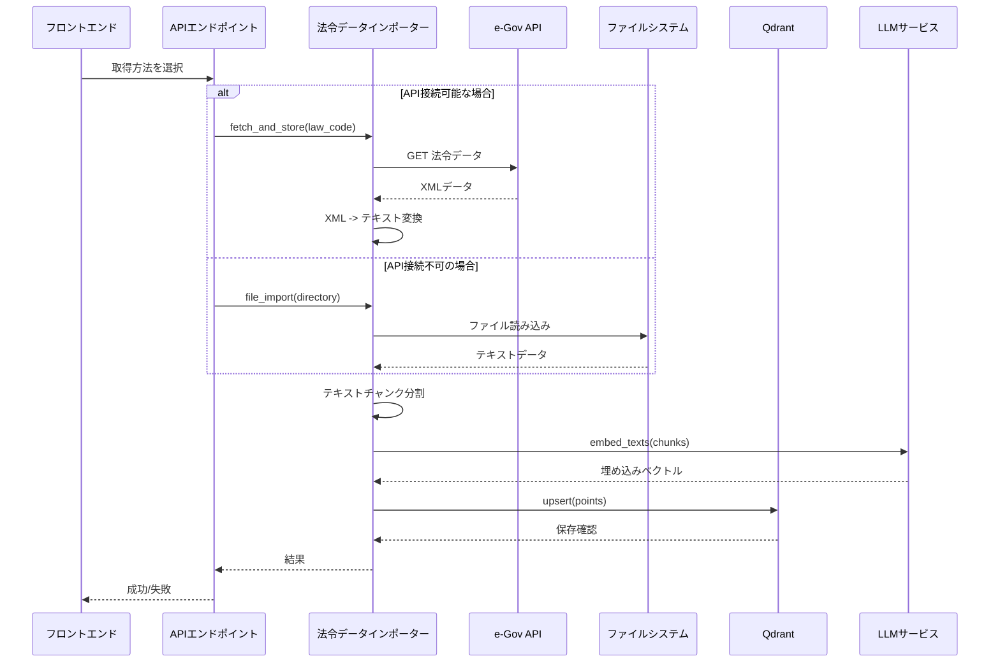

# 法令データ自動取得インポーター 詳細設計書

## 1. 概要

本設計書は、不動産関連法令を自動的に取得し、RAG（Qdrant）に登録するシステムの詳細設計を定める。

**重要**: e-Gov法令データAPIの環境依存性により、複数の実装方案を提示する。

### 1.1 目的
- 法令データを自動的に取得し、RAGに登録する
- 法令の鮮度を保持し、正確な情報を提供できる
- 完全無料のデータソースを使用する

### 1.2 対象範囲
- 環境に応じた法令データ取得方案
- データのテキスト変換とチャンク分割
- Qdrantへのベクトル埋め込み保存
- 管理APIエンドポイントの実装

---

## 2. システムアーキテクチャ

### 2.1 システム構成図

```mermaid
graph TB
    subgraph フロントエンド
        A[管理画面]
    end
    
    subgraph バックエンド
        B[APIエンドポイント]
        C[法令データインポーター]
        D[RAGサービス]
        E[LLMサービス]
    end
    
    subgraph 外部ソース
        F1[e-Gov API<br/>(環境依存)]
        F2[手動ファイル配置<br/>(常に利用可能)]
    end
    
    subgraph ストレージ
        G[Qdrant<br/>ベクトルストア]
        H[PostgreSQL<br/>メタデータ]
    end
    
    A --> B
    B --> C
    C --> F1
    C --> F2
    C --> D
    D --> G
    D --> E
    B --> H
```

### 2.2 データフロー



---

## 3. 法令データソースの環境依存性

### 3.1 テスト結果

| ソース | URL | 結果 |
|---|---|---|
| e-Gov API | `https://api.gov.go.jp/` | ❌ DNS解決エラー（環境依存） |
| e-Gov Web | `https://laws.e-gov.go.jp/` | ⚠️ SPA（直接XML取得不可） |
| 手動ファイル | `documents/reference/` | ✅ 常に利用可能 |

### 3.2 推奨方案

**環境に応じて以下の2つの方案を切り替える**:

| 環境 | 推奨方案 | 理由 |
|---|---|---|
| 開発環境（API接続可） | 方案A: 自動取得 | 鮮度高い |
| 開発環境（API不可） | 方案B: 手動配置 | 安定動作 |
| 本番環境 | 方案B: 手動配置 | 安定性優先 |

---

## 4. 実装方案A: 自動取得（API接続可能な場合）

### 4.1 e-Gov法令データAPI

**ベースURL**: `https://api.gov.go.jp/` （環境によりアクセス不可の場合あり）

**代替URL**: `https://laws.e-gov.go.jp/law/?law_num={code}` （Webサイト、スクレイピング必要）

### 4.2 主要な不動産関連法令コード

| 法令名 | 法令コード | APIパラメータ |
|---|---|---|
| 民法 | 57AC10000162 | `law_num=57AC10000162` |
| 借地借家法 | 57AC10000702 | `law_num=57AC10000702` |
| 宅地建物取引業法 | 58AC10000174 | `law_num=58AC10000174` |
| 建築基準法 | 60AC10000217 | `law_num=60AC10000217` |
| 不動産鑑定評価法 | 62AC10000058 | `law_num=62AC10000058` |
| 区分所有法 | 57AC10000180 | `law_num=57AC10000180` |

### 4.3 APIリクエスト例

```
GET https://api.gov.go.jp/cgi-bin/search/single.cgi?
    &bunrui=1
    &body=1
    &al=1
    &law_num=57AC10000162
```

### 4.4 レスポンス形式

XML形式で返却される。

```xml
<law>
  <law_num>57AC10000162</law_num>
  <title>民法</title>
  <body>
    <article>
      <article_num>第1条</article_num>
      <text>この法律は、私権の主体、内容、行使及び取得に関する基本原則を定める。</text>
    </article>
  </body>
</law>
```

---

## 5. 実装方案B: 手動ファイル配置（常に利用可能）

### 5.1 ファイル構成

```
documents/
├── reference/
│   ├── minpo/
│   │   ├── minpo_general.md        （民法総則）
│   │   └── minpo_saihan.md         （民法債権）
│   ├── real_estate/
│   │   ├── taikoken_law.md         （借地借家法）
│   │   └── takuteki_law.md         （宅地建物取引業法）
│   └── building/
│       └── kenchiku_hijun.md         （建築基準法）
└── legal_data/
    └── ...
```

### 5.2 インポートフロー

1. ファイルを`documents/reference/`に配置
2. `POST /api/system/documents/import` を呼び出す
3. ファイルがチャンク分割されQdrantに保存

---

## 6. モジュール設計

### 6.1 ファイル構成

```
backend/
├── app/
│   ├── core/
│   │   ├── legal_data_importer.py  （法令データインポーター）
│   │   ├── file_importer.py        （ファイルインポーター・既存）
│   │   ├── rag.py
│   │   └── llm.py
│   ├── api/
│   │   ├── system.py
│   │   └── legal_data.py           （法令データ管理API）
│   └── config.py
└── ...
```

### 6.2 法令データインポーターモジュール

**ファイルパス**: `backend/app/core/legal_data_importer.py`

#### 6.2.1 クラス設計

```python
class LegalDataImporter:
    """法令データインポーター"""
    
    def __init__(self):
        self.api_base_url = settings.legal_data_api_url
        self.file_directory = "documents/reference"
        self.rag_service = rag_service
        self.api_available = self._check_api_connectivity()
    
    async def fetch_law(self, law_code: str) -> str:
        """e-Gov APIから法令データを取得（API接続可な場合）"""
        pass
    
    async def parse_xml(self, xml_content: str) -> str:
        """XMLをテキストに変換"""
        pass
    
    async def store_law(
        self,
        law_code: str,
        law_name: str,
        text: str,
    ) -> dict:
        """法令データをRAGに保存"""
        pass
    
    async def fetch_and_store(
        self,
        law_code: str,
        category: str = "real_estate_law",
    ) -> dict:
        """取得して保存の一連処理（API使用）"""
        pass
    
    async def import_from_files(
        self,
        directory: str = "documents/reference",
        category: str = "real_estate_law",
    ) -> dict:
        """ファイルからのインポート（API不使用）"""
        pass
    
    async def get_import_method(self) -> str:
        """利用可能な取得方法を返す"""
        return "api" if self.api_available else "file"
```

### 6.3 APIエンドポイント設計

**ファイルパス**: `backend/app/api/legal_data.py`

#### 6.3.1 エンドポイント一覧

| メソッド | パス | 説明 |
|---|---|---|
| GET | `/api/system/legal-data/status` | 環境情報と利用可能な取得方法を返す |
| GET | `/api/system/legal-data/laws` | 登録可能な法令リスト取得 |
| POST | `/api/system/legal-data/fetch` | APIから法令を取得して保存 |
| POST | `/api/system/legal-data/import-files` | ファイルからインポート |
| GET | `/api/system/legal-data/collections` | 登録済み法令のリスト取得 |
| DELETE | `/api/system/legal-data/{law_code}` | 法令データを削除 |

#### 6.3.2 エンドポイント詳細

##### GET `/api/system/legal-data/status`

環境情報を返却。

**レスポンス例**:
```json
{
    "api_available": false,
    "api_url": "https://api.gov.go.jp/",
    "file_directory": "documents/reference",
    "file_count": 5,
    "message": "API接続不可。ファイル配置によるインポートをご利用ください。"
}
```

##### POST `/api/system/legal-data/fetch`

APIから法令を取得して保存（API接続時のみ）。

**リクエストパラメータ**:
```json
{
    "law_code": "57AC10000162",
    "category": "real_estate_law"
}
```

**レスポンス例**:
```json
{
    "method": "api",
    "law_code": "57AC10000162",
    "law_name": "民法",
    "chunk_count": 42,
    "status": "completed"
}
```

##### POST `/api/system/legal-data/import-files`

ファイルからインポート（常に利用可能）。

**レスポンス例**:
```json
{
    "method": "file",
    "imported": 3,
    "failed": 0,
    "files": [
        {
            "filename": "taikoken_law.md",
            "chunks": 15,
            "status": "success"
        }
    ]
}
```

---

## 7. 設定設計

### 7.1 設定項目

[`backend/app/config.py`](backend/app/config.py) に以下の設定を追加:

```python
class Settings(BaseSettings):
    # 既存設定...
    
    # 法令データAPI設定
    legal_data_api_url: str = "https://api.gov.go.jp/cgi-bin/search/single.cgi"
    legal_data_api_enabled: bool = false  # 環境により自動判定
    
    # ファイルインポート設定
    legal_data_file_directory: str = "documents/reference"
```

### 7.2 法令リストファイル

**ファイルパス**: `backend/app/data/legal_laws.json`

```json
[
    {
        "code": "57AC10000162",
        "name": "民法",
        "short_name": "民法",
        "category": "civil_law",
        "enabled": true,
        "priority": 1
    },
    {
        "code": "57AC10000702",
        "name": "借地借家法",
        "short_name": "借地借家法",
        "category": "real_estate_law",
        "enabled": true,
        "priority": 2
    },
    {
        "code": "58AC10000174",
        "name": "宅地建物取引業法",
        "short_name": "宅地建物取引業法",
        "category": "real_estate_law",
        "enabled": true,
        "priority": 3
    }
]
```

---

## 8. エラーハンドリング

### 8.1 エラーケース

| エラーコード | メッセージ | 対処法 |
|---|---|---|
| `NETWORK_ERROR` | ネットワーク接続に失敗しました | ファイル配置によるインポートにフォールバック |
| `INVALID_LAW_CODE` | 無効な法令コードです | パラメータを確認 |
| `API_RATE_LIMIT` | APIレート制限に達しました | 待機後再試行 |
| `PARSE_ERROR` | XMLパースに失敗しました | データ形式を確認 |
| `STORE_ERROR` | RAGへの保存に失敗しました | Qdrant接続を確認 |

### 8.2 リトライ処理

```python
import asyncio
from tenacity import retry, stop_after_attempt, wait_exponential

@retry(
    stop=stop_after_attempt(3),
    wait=wait_exponential(multiplier=1, min=2, max=10)
)
async def fetch_law(self, law_code: str) -> str:
    # API呼び出し
    pass
```

---

## 9. 安全対策

### 9.1 API制限

- 1リクエストごとに2秒の待機時間
- 並列処理は最大2スレッドまで
- エラー時は指数バックオフで再試行

### 9.2 データ整合性

- 取得したデータは原文をそのまま保存
- 更新検知のため最終改正日を追跡
- 既存データとの差分を比較

### 9.3 出明明

- 各チャンクに `source_url` を付与
- 法令コード、法令名、改正履歴をメタデータとして保存
- ファイル配置の場合はファイルパスを保存

---

## 10. 実装スケジュール（参考）

| フェーズ | タスク | 目安 |
|---|---|---|
| 1 | `legal_data_importer.py` の実装（両方案対応） | 2-3時間 |
| 2 | `legal_data.py` APIエンドポイントの実装 | 2時間 |
| 3 | 法令リストファイルの作成 | 30分 |
| 4 | テスト（API接続確認、ファイルインポート確認） | 1-2時間 |
| 5 | フロントエンド管理画面の実装 | 2-3時間 |

---

## 11. 今後の拡張

### 11.1 判例データの追加
- 裁判所ウェブサイトからの判例データ取得
- 判例検索APIとの連携

### 11.2 定期更新機能
- Cronジョブによる定期更新
- 改正履歴の自動検知

### 11.3 管理者画面
- 法令リストのGUI管理
- インポート履歴の表示
- 更新アラート機能
