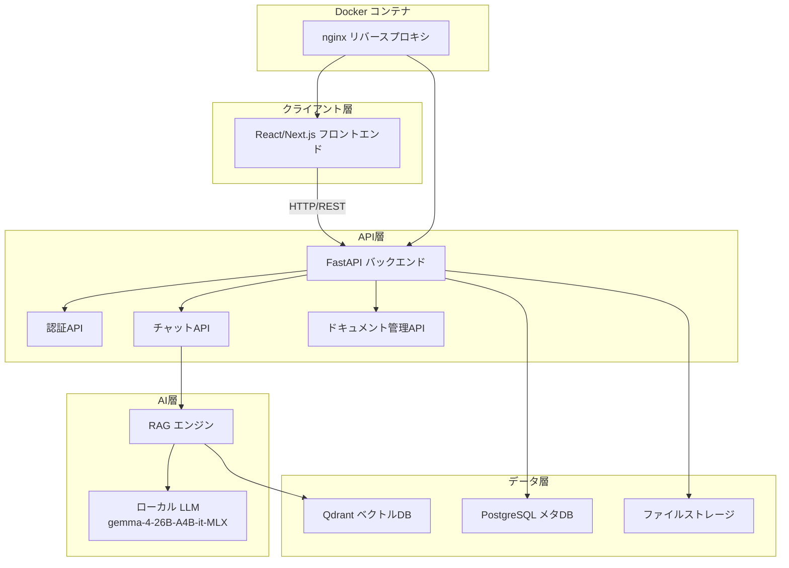
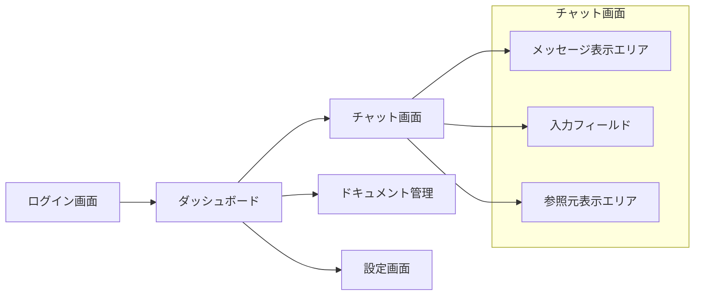
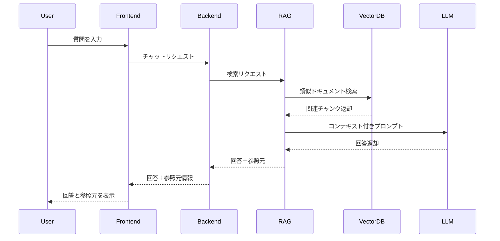

# 不動産法律AIシステム 設計計画書

## 1. システム概要

宅地建物取引士試験（宅建）の学習・法令検索に特化したAIチャットシステム。
将来的には顧客納品も視野に入れた本格的なビジネスアプリケーション。

## 2. システムアーキテクチャ



## 3. コンポーネント詳細

### 3.1 バックエンド（FastAPI）

#### APIエンドポイント設計

| API | メソッド | パス | 説明 |
|-----|----------|------|------|
| 認証 | POST | /api/auth/login | ログイン |
| 認証 | POST | /api/auth/register | ユーザー登録 |
| チャット | POST | /api/chat | AIへの質問 |
| チャット | GET | /api/conversations | 会話履歴一覧 |
| チャット | GET | /api/conversations/{id} | 会話詳細 |
| ドキュメント | POST | /api/documents/upload | ドキュメントアップロード |
| ドキュメント | GET | /api/documents | ドキュメント一覧 |
| ドキュメント | DELETE | /api/documents/{id} | ドキュメント削除 |
| 検索 | GET | /api/search | ベクトル検索 |

#### 主要機能
- JWT認証によるユーザー管理
- APIレートリミット
- リクエストログ記録
- エラーハンドリング

### 3.2 フロントエンド（React/Next.js）

#### 画面構成



#### 主要画面
1. **ログイン画面**
   - メールアドレス/パスワード認証
   - JWTトークン管理

2. **ダッシュボード**
   - 会話履歴一覧
   - 新規チャット開始ボタン

3. **チャット画面**
   - スレッド形式の会話表示
   - AI回答と参照元の同時表示
   - 参照元ドキュメントへのリンク

4. **ドキュメント管理画面**
   - PDF/Word/テキストファイルのアップロード
   - ドキュメント一覧・検索
   - チャンク設定

### 3.3 ベクトルデータベース選定

| 機能 | Qdrant | ChromaDB | FAISS |
|------|--------|----------|-------|
| ローカル動作 | ○ | ○ | ○ |
| メタデータフィルタ | ○ | △ | × |
| APIインターフェース | ○ | ○ | △ |
| スケーラビリティ | ○ | △ | △ |
| 納品対応 | ○ | △ | △ |

**推奨：Qdrant**
- REST APIとgRPCの両方に対応
- メタデータによる高度なフィルタリング
- 大規模データセットへの対応力
- Dockerコンテナでの簡単デプロイ

### 3.4 RAGパイプライン設計



#### RAGプロセス
1. **クエリ処理**
   - ユーザーの質問をベクトル化
   - 専門用語の正規化

2. **ベクトル検索**
   - Qdrantで類似ドキュメントを検索
   - 上位K件のチャンクを取得

3. **コンテキスト構築**
   - 検索結果をプロンプトに組み込み
   - 参照元情報を付加

4. **LLM回答生成**
   - ローカルLLMにリクエスト送信
   - 回答と参照元を解析

### 3.5 LLM連携設計

#### 設定
- **モデル**: lmstudio-community/gemma-4-26B-A4B-it-MLX-8bit
- **エンドポイント**: http://192.168.188.50:1234/v1
- **インタフェース**: OpenAI互換API

#### プロンプト設計
```
システムプロンプト:
あなたは宅地建物取引士試験に詳しいAIアシスタントです。
以下の参照情報に基づいて、正確な回答を行ってください。
回答後には、使用した参照元のドキュメント名とページ番号を明記してください。

ユーザー質問: {question}

参照情報:
{context}
```

### 3.6 Dockerコンテナ化設計

#### コンテナ構成

| サービス | イメージ | ポート | 役割 |
|----------|----------|--------|------|
| nginx | nginx:alpine | 80, 443 | リバースプロキシ |
| frontend | node:20 | - | Next.jsビルド |
| backend | python:3.12 | 8000 | FastAPI |
| qdrant | qdrant/qdrant | 6333, 6334 | ベクトルDB |
| postgres | postgres:16 | 5432 | メタDB |

#### docker-compose.yml 構成
```yaml
services:
  nginx:
    ports: ["80:80"]
  
  frontend:
    build: ./frontend
    volumes: ["frontend-next-data:/app/.next"]
  
  backend:
    build: ./backend
    ports: ["8000:8000"]
    volumes: ["./data:/app/data"]
    depends_on: [qdrant, postgres]
  
  qdrant:
    ports: ["6333:6333"]
    volumes: ["./qdrant_storage:/qdrant/storage"]
  
  postgres:
    ports: ["5432:5432"]
    volumes: ["./postgres_data:/var/lib/postgresql/data"]
```

### 3.7 宅建関連法令登録計画

#### 第1段階：核心法令
- 宅地建物取引業法
- 媒介契約書の様式
- 重要事項説明書

#### 第2段階：関連法令
- 借地借家法
- 民法（借家関係）
- 建築基準法

#### 第3段階：応用分野
- 相続税・固定資産税関連
- 土地活用の税法
- 管理組合関連法規

#### ドキュメント登録プロセス
1. PDF/Wordファイルのアップロード
2. テキスト抽出（OCR対応）
3. チャンキング（セクション単位）
4. ベクトル埋め込み生成
5. Qdrantへの登録
6. メタデータ（出典、ページ番号）の付加

## 4. ディレクトリ構造

```
real-estate-ai/
├── docker-compose.yml
├── .env.example
├── backend/
│   ├── Dockerfile
│   ├── pyproject.toml
│   ├── app/
│   │   ├── main.py
│   │   ├── api/
│   │   │   ├── auth.py
│   │   │   ├── chat.py
│   │   │   └── documents.py
│   │   ├── core/
│   │   │   ├── rag.py
│   │   │   └── llm.py
│   │   ├── models/
│   │   │   └── database.py
│   │   └── services/
│   │       ├── auth_service.py
│   │       └── chat_service.py
│   └── tests/
├── frontend/
│   ├── Dockerfile
│   ├── package.json
│   ├── next.config.js
│   └── src/
│       ├── app/
│       ├── components/
│       │   ├── ChatInterface.tsx
│       │   ├── DocumentManager.tsx
│       │   └── SourceDisplay.tsx
│       └── lib/
│           └── api.ts
└── documents/
    └── reference/
        ├── taikoken_hou.md
        └── media_contract.md
```

## 5. 技術スタックまとめ

| 層 | 技術 | 理由 |
|----|------|------|
| バックエンド | FastAPI | 非同期対応、自動APIドキュメント |
| フロントエンド | Next.js + React | SSR対応、SEO対策、スケーラビリティ |
| ベクトルDB | Qdrant | メタデータフィルタ、スケーラビリティ |
| 関係DB | PostgreSQL | 信頼性、JSONサポート |
| LLM | gemma-4-26B-A4B-it-MLX | ローカル実行、高品質 |
| コンテナ | Docker | 環境統一、簡単納品 |
